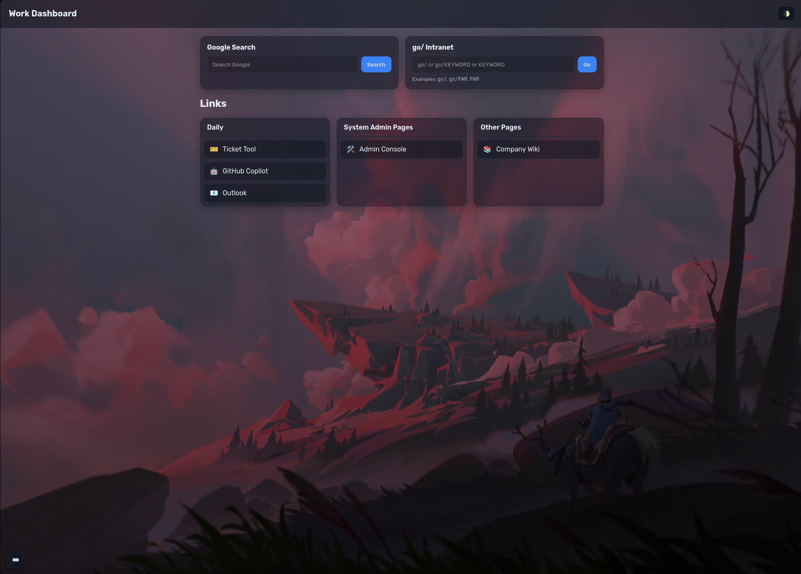

#
## Work Dashboard



Minimal, fast, and elegant personal start page for work. It gives you:

- Quick access to your daily links
- A Google search box that can drive the embedded mini-browser or open a new tab
- A `go/` launcher for intranet shortcuts (e.g., `go/`, `go/PAM`, or `PAM`)
- A command palette (Quick Launcher) with fuzzy search and keyboard shortcuts
- Auto/light/dark theme with optional cycling wallpapers

---

## Features

- **Command palette (Quick Launcher)**: Press Mod+K (Ctrl/Cmd+K) to fuzzy-search all links and `go/` keys.
- **Google search**: Type a query and either open in the mini browser or a new tab.
- **`go/` intranet shortcuts**: Type `go/`, `go/KEY`, or `KEY` to jump to your mapped destinations.
- **Mini browser**: A movable, resizable embedded browser with URL bar and target select (Embed/New Tab). You can disable it via `miniBrowser.enable`.
- **Theming**: Auto resolves from system preference, with manual toggle and persistence.
- **Wallpapers**: Optional image cycler with separate light/dark sets and graceful crossfade.
- **Privacy-friendly analytics (optional)**: Local-only counts in `localStorage` to improve Quick Launcher ranking.

---

## How it works

At load time, `app.js` merges three config sources in order with a deep-merge strategy:
1. Built-in defaults defined in code
2. `window.DASHBOARD_DEFAULT_CONFIG` from `config.example.js`
3. Your overrides from `window.DASHBOARD_CONFIG` in `config.js`

Then it initializes:

- **Theme**: Reads saved theme or system preference; toggling updates `localStorage` and background cycler.
- **Background cycler**: Creates two overlapping layers and crossfades between images every `cycleMs`. Honors `prefers-reduced-motion`.
- **Sections/links**: Renders cards from `config.sections` into `#linksGrid` with icons and labels.
- **Google form**: Builds the search URL from `google.baseUrl` and `google.queryParam`; opens in mini browser or new tab.
- **`go/` form**: Resolves keys using `go.keyToUrl`, falls back to `go.fallbackSearchUrl` if provided, or `go.homepageUrl`.
- **Mini browser**: Initializes from `miniBrowser.defaultUrl` if `miniBrowser.enable !== false`; Enter in the URL bar opens in embed or new tab.
- **Quick Launcher**: Indexes all links and `go/` keys; fuzzy-search with scoring, keyboard navigation, and open-in-tab.
- **Global shortcuts**: See Keyboard Shortcuts below.

Security-conscious defaults:
- Strict Content Security Policy in `index.html` allows only same-origin scripts/styles and HTTPS images/frames.
- Strong `referrerpolicy` and `rel` attributes on external links.

---

## Quick start

1. Clone/download this project.
2. Copy config and customize:
  - Copy `config.example.js` → `config.js`
  - Edit `config.js` and set your links, and wallpapers
  - To disable the mini browser entirely, set:
    ```js
    window.DASHBOARD_CONFIG = { miniBrowser: { enable: false } };
    ```
3. Open it:
  - Easiest: open `index.html` directly in your browser
  - Recommended: serve locally for a proper origin (helps with CSP, caching, and PWA)
    - `python3 -m http.server 8000` → visit `http://localhost:8000`

> Note: `config.js` is git-ignored so your work-specific links remain private.

> Tip: Only override what you need; unspecified fields fall back to defaults.

---

## Keyboard shortcuts

- **Open/close Quick Launcher**: Mod+K (Ctrl/Cmd+K)
- **Close Quick Launcher**: Escape
- **Next result**: ArrowDown
- **Previous result**: ArrowUp
- **Open selection**: Enter
- **Toggle theme**: t
- **Focus Google**: /
- **Focus `go/`**: g

You can change these in `config.js` under `keybinds`.

---

## Wallpapers

Place images under `wallpapers/light/` and `wallpapers/dark/` (existing folders are included). Then reference them in `config.js` `backgrounds.light` and `backgrounds.dark` arrays. The active set switches automatically with the theme.

Motion accessibility: if a user has `prefers-reduced-motion: reduce`, auto-cycling pauses.

---

## Deployment

This is a static site. Host it anywhere that can serve static files:
- GitHub Pages, Netlify, Vercel, S3 + CloudFront, or your internal static host.

Ensure your host serves the files with the correct MIME types and preserves the directory structure.

---

## Progressive Web App (optional)

This site can be installed as a PWA and works offline for the app shell and cached wallpapers.

- Manifest: `manifest.webmanifest`
- Service worker: `sw.js` (caches app shell + same‑origin assets)
- Install prompt: small button appears when installable

To disable PWA, remove the `<link rel="manifest">` and service worker registration in `index.html`.

---

## Project structure

- `index.html` — HTML structure, CSP, widgets, overlays
- `styles.css` — UI styling, light/dark themes, mini browser, Quick Launcher
- `config.example.js` — default config (reference only; do not edit)
- `config.js` — your private overrides (ignored by git)
- `src/app.ts` — TypeScript source for client app
- `src/sw.ts` — TypeScript source for service worker
- `app.js` — build output (compiled from TypeScript)
- `sw.js` — build output (compiled from TypeScript)
- `wallpapers/` — sample images for light/dark sets

---

## Privacy

No external analytics. If `analytics.enableLocal` is true in your `config.js`, simple usage counters are stored in `localStorage` only and used to improve Quick Launcher ranking on your device.

---

## CSP notes

The default CSP currently includes `style-src 'unsafe-inline'` due to dynamic UI transitions and minimal inline script for the service worker registration. We are actively replacing ad‑hoc inline styles with CSS classes/variables (e.g., background crossfade uses a `no-transition` class), which will allow removal of `'unsafe-inline'` in a future release. If you self‑host with a stricter CSP today, consider adding a nonce/hash and moving the small inline registration into `app.js`.


## FAQ

- "Why do I need a local server?" — Opening `index.html` directly works, but a local server provides a proper origin which can avoid CSP and caching quirks.
- "Where do I put company-specific links?" — In `config.js`. It stays out of version control.

