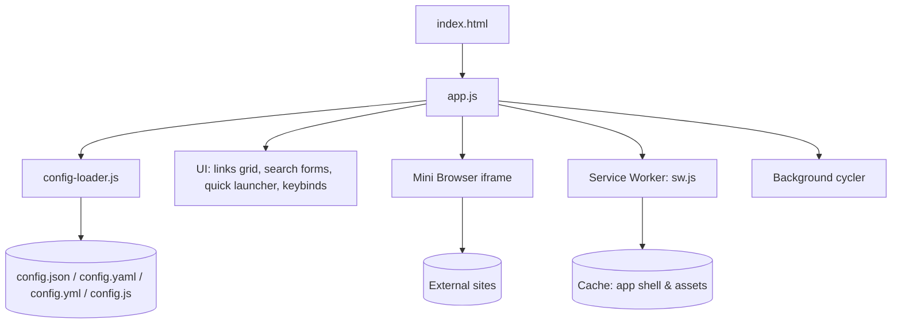

# Architecture

## TL;DR (Plain English)
- Single-page app; no backend
- Config merged at startup; UI wired from `src/app.ts`
- Optional PWA via service worker

## Step-by-step
1. Load `index.html` → scripts load (`config.example.js`, `config-loader.js`, optional `config.js`, `app.js`)
2. Startup merges config and initializes UI and features
3. SW caches app shell and assets

## Technical Details

- Defaults defined in `src/app.ts` (lines 425–507)
- SW behavior in `src/sw.ts` and built `sw.js`
- Config parsing in `config-loader.js` (JSON + YAML-lite, bypass cache for config files)

## Common Pitfalls
- CSP blocks external embeds in iframe depending on site policy; use New Tab target

## Troubleshooting
| Symptom | Likely Cause | How to Fix |
| --- | --- | --- |
| External site not loading in embed | X-Frame-Options/CSP | Switch target to New Tab |

## References
- `index.html`, `src/app.ts`, `config-loader.js`, `src/sw.ts` 